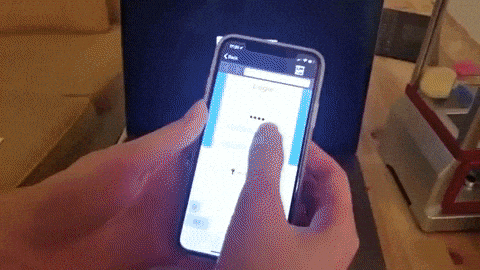

# Claw-Catcher
**An internet-based claw catcher motivated by the old-fashion claw machine inside Walmart.**

# Demo 
Please see this short youtube video for full demo:smiley:: https://youtu.be/82ttiICEKp4

# Introduction
This project consists of three components:

* __Flask Web Application:__  
Used Flask micro web application framework to not only serve different web pages to client, but also send/receive message to/from rabbitMQ broker. Be able to store user and game information in MongoDB Atlas cloud storage.

* __Claw Machine (Raspberry Pi):__  
For the claw machine end, A script is implemented to get message from RabbitMQ broker. Base on different message, the script will send ON/OFF signal to the pins on raspberry pi. Once an "ON" signal is received, the claw machine will start and music started playing. 

* __Client Mobile Application:__   
The IOS application will responsible for scanning QR code, and retrieve game status from time to time.

